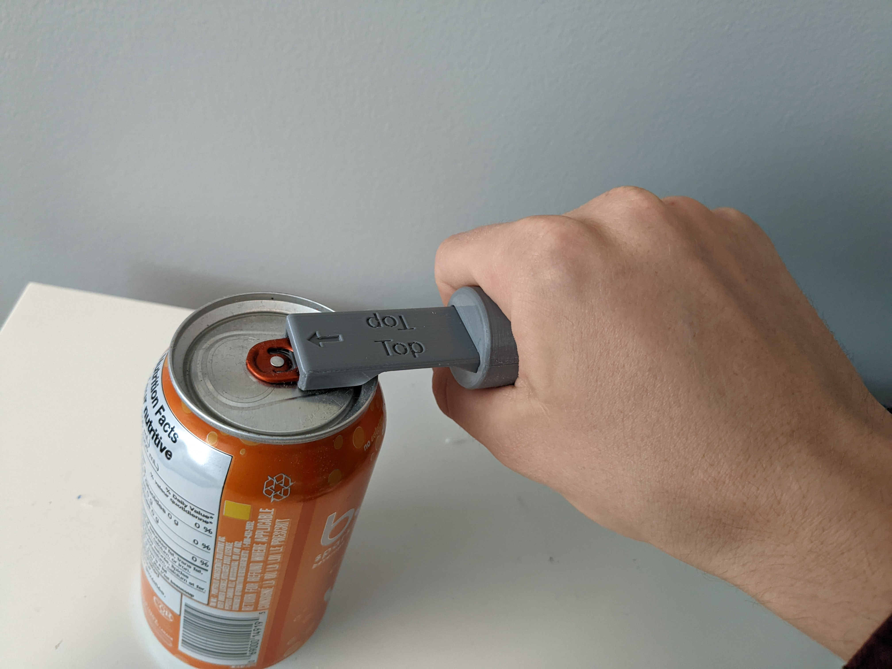

# Customizable Beverage Can Opener
The Customizable Beverage Can Opener is a beverage opening tool with different handle options for users with low strength and accuracy.

## More info at
- [Makers Making Change Project Page](https://makersmakingchange.com/project/customizable-beverage-can-opener/)

## How to Obtain a Customizable Beverage Can Opener
### 1. Do it Yourself (DIY) or Do it Together (DIT)

This is an open-source assistive technology, so anyone is free to build it. All of the files and instructions required to build the Customizable Beverage Can Opener are contained within this repository. Refer to the Maker Checklist below.

### 2. Request a build of this device

If you would like to obtain a Customizable Beverage Can Opener, you may submit a build request through the [MMC Library Page](https://makersmakingchange.com/project/customizable-beverage-can-opener). The requestor is responsible for the cost of materials and any shipping.

### 3. How to build this device for someone else

If you have the skills and equipment to build this device, and would like to donate your time to create the switch for someone who needs it, visit the [MMC Maker Wanted](https://makersmakingchange.com/maker-wanted/) section.

## Getting Started

### 1. Read the Makers Checklist

The [Makers Checklist](Documentation/Customizable_Beverage_Can_Opener_Maker_Checklist_v1.0.pdf).

### 2. Print the 3D Printable components

Print the Base Can Opener and, optionally, any of the three handle designs.

All of the files and individual print files can be in the [/Build_Files/3D_Printing_Files](/Build_Files/3D_Printing_Files) folder.

### 3. Assemble the Customizable Berage Can Opener

Reference the [User Quick Guide](Documentation/Customizable_Beverage_Can_Opener_User_Guide_v1.0.pdf) for the tools and steps required to build each portion.

## Files
### Documentation
| Document             | Version | Link |
|----------------------|---------|------|
| Design Rationale     | 1.0     | [Customizable_Beverage_Can_Opener_Design_Rationale](/Documentation/Customizable_Beverage_Can_Opener_Design_Rationale_v1.0.pdf)     |
| Maker Checklist      | 1.0     | [Customizable_Beverage_Can_Opener_Maker_Checklist](/Documentation/Customizable_Beverage_Can_Opener_Maker_Checklist_v1.0.pdf)     |
| Bill of Materials    | 1.0     | [Customizable_Beverage_Can_Opener_Bill_of_Materials](/Documentation/Customizable_Beverage_Can_Opener_BOM_v1.0.csv)     |
| 3D Printing Guide    | 1.0     | [Customizable_Beverage_Can_Opener_3D_Printing_Guide](/Documentation/Customizable_Beverage_Can_Opener_3D_Print_Guide_v1.0.pdf)     |
| User Guide           | 1.0     | [Customizable_Beverage_Can_Opener_User_Guide](/Documentation/Customizable_Beverage_Can_Opener_User_Guide_v1.0.pdf)    |
| Changelog            | 1.0     | [Customizable_Beverage_Can_Opener_Changelog](/Documentation/Customizable_Beverage_Can_Opener_Changelog_v1.0.pdf)     |

### Design Files
[CAD Files](/Design_Files)

### Build Files
 - [3D Printing Files](/Build_Files/3D_Printing_Files)

## Attribution
Designers:
 - Idea for base can opener based on the design of pop-top can opener by Thingiverse User VegasGuy under the Creative Commons license - Attribution - Non-Commercial - No Derivatives.
 - Idea for Flat Handle based on Can Opener Helper by Pole Ergo under the Creative Commons license - Attribution - Non-Commercial - No Derivative.
 - Full Design by Neil Squire / Makers Making Change under license.
 - Documentation by Neil Squire / Makers Making Change.

## License
Everything needed or used to design, make, test, or prepare the Customizable Beverage Can Opener is licensed under the CERN 2.0 Permissive license <https://ohwr.org/project/cernohl/wikis/Documents/CERN-OHL-version-2> (CERN-OHL-P). 

 <Device-Name> by <a xmlns:cc="http://creativecommons.org/ns#" href="www.makersmakingchange.com" property="cc:attributionName" rel="cc:attributionURL">Neil Squire</a> is licensed under a <a rel="license" href="http://creativecommons.org/licenses/by-sa/4.0/">Creative Commons Attribution-ShareAlike 4.0 International License</a>.

<!-- ABOUT MMC START -->
## About Makers Making Change

Makers Making Change is a program of [Neil Squire](https://www.neilsquire.ca/), a Canadian non-profit that uses technology, knowledge, and passion to empower people with disabilities.

Makers Making Change leverages the capacity of community based Makers, Disability Professionals and Volunteers to develop and deliver affordable Open Source Assistive Technologies.

 - Website: [www.MakersMakingChange.com](https://www.makersmakingchange.com/)
 - GitHub: [makersmakingchange](https://github.com/makersmakingchange)
 - Bluesky: [@makersmakingchange.bsky.social](https://bsky.app/profile/makersmakingchange.bsky.social)
 - Instagram: [@makersmakingchange](https://www.instagram.com/makersmakingchange)
 - Facebook: [makersmakechange](https://www.facebook.com/makersmakechange)
 - LinkedIn: [Neil Squire Society](https://www.linkedin.com/company/neil-squire-society/)
 - Thingiverse: [makersmakingchange](https://www.thingiverse.com/makersmakingchange/about)
 - Printables: [MakersMakingChange](https://www.printables.com/@MakersMakingChange)

### Contact Us
For technical questions, to get involved, or to share your experience we encourage you to [visit our website](https://www.makersmakingchange.com/) or [contact us](https://www.makersmakingchange.com/s/contact).
<!-- ABOUT MMC END -->
